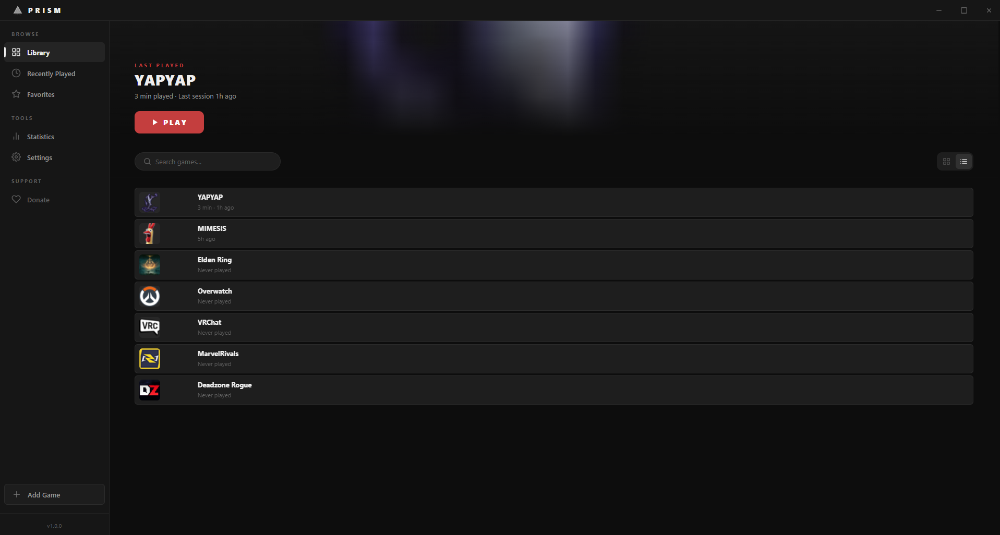

<p align="center">
  
</p>

<h1 align="center">Prism Launcher</h1>

<p align="center">
  A lightweight, high-performance game launcher for managing and launching your PC game library.
</p>

<p align="center">
  <a href="https://github.com/Braedennn/Project-Prism/releases/latest">Download</a>
</p>

---

## Features

- **Game Library Management** — Add, edit, organize, and remove games with automatic icon extraction from executables
- **Playtime Tracking** — Automatically tracks play sessions and total playtime per game
- **Multiple Views** — Grid and list layouts, Recently Played, Favorites, and Statistics dashboards
- **System Tray Support** — Minimize to tray to keep Prism running in the background
- **Desktop Notifications** — Get notified when a game session ends with time played
- **Game Sorting** — Sort your library by name, recently played, most played, or date added
- **Minimize on Launch** — Automatically minimize Prism when starting a game
- **Favorites** — Star your most-played games for quick access
- **Statistics Dashboard** — View total playtime, session counts, and a most-played leaderboard
- **Context Menu** — Right-click games to play, edit, favorite, open file location, or remove
- **Clean Dark UI** — Flat dark interface with subtle crimson accents and smooth animations

## Screenshots

<p align="center">
  
</p>

## Installation

### Installer
Download the latest **Prism Launcher Setup.exe** from the [Releases](https://github.com/Braedennn/Project-Prism/releases/latest) page. Run the installer and follow the prompts — desktop and start menu shortcuts are created automatically.

### Build from Source

```bash
git clone https://github.com/Braedennn/Project-Prism.git
cd Project-Prism
npm install
npm start
```

To build the installer:

```bash
npm run build
```

The output will be in the `dist/` folder.

## Tech Stack

- **Electron** — Cross-platform desktop framework
- **Vanilla JavaScript** — No frontend frameworks, pure modular JS
- **CSS Custom Properties** — Themeable design system
- **Node.js** — Backend process management and file I/O

## Project Structure

```
Project-Prism/
├── main.js              # Electron main process
├── preload.js           # Context bridge for IPC
├── src/
│   ├── index.html       # Application shell
│   ├── css/             # Modular stylesheets
│   │   ├── variables.css
│   │   ├── layout.css
│   │   ├── sidebar.css
│   │   ├── library.css
│   │   ├── game-detail.css
│   │   ├── modal.css
│   │   └── ...
│   ├── js/              # Application modules
│   │   ├── app.js
│   │   ├── library-manager.js
│   │   ├── game-card.js
│   │   ├── settings.js
│   │   ├── animation-engine.js
│   │   └── ...
│   └── assets/          # Icons and images
└── package.json
```

## License

MIT

## Support

If you enjoy using Prism Launcher, consider supporting development:

[](https://buymeacoffee.com/TotallyNoire)
